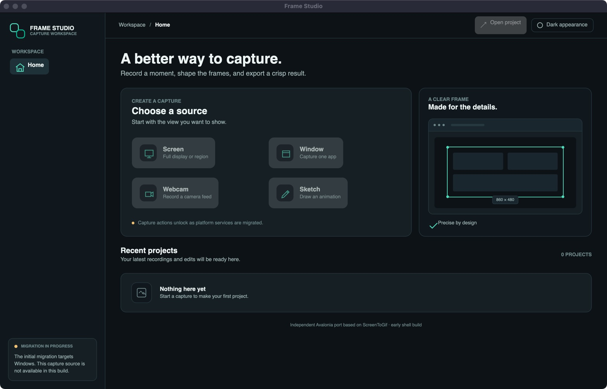
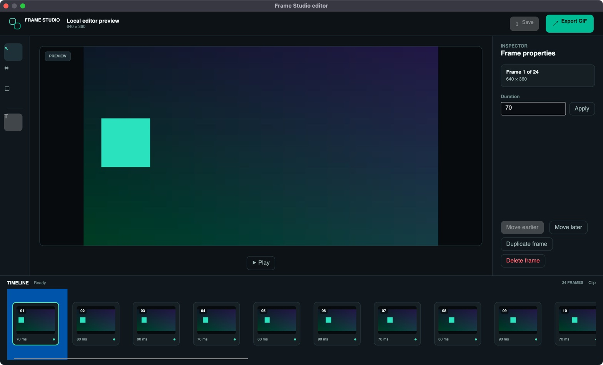

# Frame Studio

**An independent Avalonia port of ScreenToGif, built for the Avalonia Port Challenge.**

Frame Studio is a new desktop workspace for recording, editing, and exporting short screen animations. The migration keeps the original ScreenToGif repository as its functional reference while building a new Avalonia UI and separating reusable logic from Windows-specific services.

This is an independent project. It is not the official ScreenToGif application and is not affiliated with or endorsed by Nicke Manarin or N-Tech.

## Challenge target

The first challenge entry targets **Windows x64** and is positioned as a legacy revival/everyday tool. The Avalonia editor and project/export core also run on macOS, but screen recording is unavailable there; Linux has not been packaged or validated. Frame Studio is not claiming a three-platform capture port, so it should not be entered as a Best Cross-Platform Port in its current state. The Windows Actions artifact linked below is a temporary validation candidate, not the permanent judge-facing download; publish a release asset after the interactive Windows checks pass.

## Current status

The Avalonia app connects Windows screen-region recording to a native `.fsp` project, a frame editor, and GIF/MP4 export. The current home and editor UI use a Jitter-inspired workspace layout adapted for Frame Studio's frame workflow. The Win32/GDI capture backend is implemented and wired into the UI; its native integration tests now pass on a hosted Windows runner, while the interactive app workflow still needs a Windows desktop check. macOS builds and core tests work; screen capture is Windows-only.

| Area | Status |
| --- | --- |
| Avalonia home and editor | Implemented; persistent recent-project list; Jitter-inspired light workspace and editor; current Mac visual review completed, Windows visual comparison still pending |
| Dark and light appearance | Implemented |
| Neutral frame/project foundation | Frame model and compressed `.fsp` archive read/write implemented |
| Platform service contracts | Defined |
| Windows screen-region capture | Setup, display selection, area selection, frame rate, cursor option, pause, stop, and app-window exclusion are wired; native backend tests pass on hosted Windows, while the full interactive app workflow still needs verification |
| End-to-end recording workflow | Records frames into `.fsp` projects and opens the editor when recording stops |
| Editor | Frame thumbnails, preview/playback, selection, earlier/later ordering, duplicate/delete, duration edits, drag crop, project-wide resize, all-frame text and freehand overlays, save/discard, and GIF export implemented; keyboard shortcuts cover save, duplicate, reorder, delete, playback, and crop cancel |
| GIF export | Migrated encoder, editor export flow, and completion actions for opening the GIF, showing its folder, or copying its path |
| MP4 export | H.264 MP4 through FFmpeg's `libx264`, with variable frame durations preserved; requires FFmpeg on `PATH` with `libx264` enabled |
| Core workflow checks | On 2026-10-10, 44 tests passed on macOS and three Windows-only desktop checks skipped there. [Windows CI run 38028043199](https://github.com/kris70lesgo/frame-studio/actions/runs/38028043199) passed macOS/Windows builds and tests plus Windows x64 packaging. Hosted Windows passed 40 deterministic tests (one FFmpeg-dependent skip), all 6 native capture tests, and confirmed the packaged app created a top-level window titled “Frame Studio” in a non-interactive smoke check. These checks exercise GIF palette indexing, GDI pixel capture, pause/resume/stop, and window-affinity lifecycle, but do not verify the interactive Avalonia workflow or mixed-DPI desktop behavior. Cross-platform checks cover recording → edit → save/reopen → GIF export, editor commands, text/freehand overlays, recovery, project archives, GIF pixels/timing, MP4 timing, and screen-region scaling logic |
| Webcam, isolated window capture, sketchboard | Not migrated yet; the current Win32 window service captures a desktop rectangle, which can include overlapping windows, so its UI remains disabled |
| Annotations and video export | Rasterized text and freehand overlays plus H.264 MP4 export are implemented; additional video encoders are not migrated yet |
| Windows platform adapter | Win32 monitor/window enumeration and bounded GDI desktop-region recording implemented; native backend tests pass on hosted Windows, with interactive UI, app-window exclusion, and mixed-DPI validation still pending |

The original WPF application remains in this repository as the baseline in `GifRecorder.sln`. The new application is in `FrameStudio.sln` and does not reference the WPF UI projects.

## Migration write-up (working draft)

The source baseline is ScreenToGif 2.43.2 at upstream commit `a4d0a67c2131cd048ceec86cd40afc2f1a06f2fd`. I kept its WPF solution intact and built Frame Studio beside it. The WPF application could not run on the macOS development host, so this port began with a source audit and upstream screenshots as references; fresh same-content baseline captures still require Windows.

The byte-oriented GIF encoder and selected quantizers moved into `FrameStudio.Core` after replacing WPF geometry and color boundaries with neutral pixel types. The old model, ViewModels, and UI could not be referenced directly: they depend on WPF media, dispatcher, and input types. I rebuilt the recording/editor shell in Avalonia, added a compressed `.fsp` project archive, and placed capture behind platform interfaces with a Windows GDI implementation. The original MS-PL notices and license remain in the repository.

Cross-platform tests feed deterministic fake frames through recording, edit/reorder, text/freehand raster edits, save/reopen, and GIF export, then decode and check the GIF pixels and timing. They establish the workflow between the capture-service boundary and export. Separate hosted Windows integration tests now verify native GDI capture, pause/resume/stop, and display-affinity lifecycle. They do not launch the actual Avalonia recorder or verify that its windows disappear from the recording. The [Windows validation checklist](docs/WINDOWS_VALIDATION.md) records the remaining interactive checks. Webcam, sketchboard, isolated window capture, and macOS/Linux capture are not complete.

Two surprises shaped the port. The legacy model and utility projects carry WPF types far beyond the visible UI, so a neutral core boundary proved more practical than referencing those assemblies. Windows GDI's common desktop DC must also be released by the thread that acquired it; a source review caught and fixed that lifetime issue before the Windows runtime check. The [audit](docs/MIGRATION_AUDIT.md) and [journal](docs/MIGRATION.md) record the source classification and implementation decisions.

The first Frame Studio shell commit and latest capture-backend fix span about **6 hours 20 minutes** in the Git timestamps on 3 October 2026 (India time). That is elapsed time between commits, not measured hands-on effort; we did not keep a work timer, so the final labor cost is still unknown. The write-up needs Windows results, comparable screenshots, and a better effort estimate before submission.

## Shell preview

This macOS capture documents an early Avalonia shell only. It is not a Windows before/after comparison, and it predates the recording and editor workflow shown in the status table.
The [capture notes](docs/before-after/README.md) link to the upstream screenshots and list the fresh Windows pairs still needed for submission.



The editor screenshot predates the text annotation and MP4 export tools and records a macOS UI smoke check with a local sample project. It shows the earlier editor shell only; the current dialogs and export controls still need a fresh visual check, and capture still requires Windows validation.



## Build and run

Requirements: .NET SDK 9.0.318 or a compatible .NET 9 feature-band SDK, with NuGet access for the Avalonia packages.

The Avalonia UI uses the desktop Avalonia stack. The current self-contained Windows x64 candidate is available from [CI run 38028043199's `FrameStudio-win-x64` artifact](https://github.com/kris70lesgo/frame-studio/actions/runs/38028043199/artifacts/11660393817); sign in to GitHub with repository read access to download it. Its SHA-256 is `a4628e48909f849cfa39d41436ade55ef6d2965263397e24b548be7db077a38c`. The older [Preview 3 release](https://github.com/kris70lesgo/frame-studio/releases/tag/v0.1.0-preview.3) does not contain the current UI. Only Windows has a capture backend. Screen capture requires Windows 10 version 2004 or later because the app excludes its own windows from captured frames. Core project editing and GIF export are platform-neutral. MP4 export calls the user's FFmpeg installation and needs `libx264`; Frame Studio does not redistribute FFmpeg. The full recording workflow must be exercised on Windows before claiming a verified Windows release; no macOS or Linux capture support is claimed.

```sh
dotnet build FrameStudio.sln
dotnet test FrameStudio.sln
dotnet run --project FrameStudio.Avalonia/FrameStudio.Avalonia.csproj
```

To create a self-contained local Windows x64 candidate, run `python3 scripts/package-windows-candidate.py`. It writes the package, README, full license, and SHA-256 checksum under ignored `dist/`. The package remains a development candidate until its Windows runtime checks pass.

`global.json` selects .NET 9 for this migration. The original WPF application targets Windows; this macOS development host can compile it with Windows targeting enabled, but cannot run it.

## Project structure

- `FrameStudio.Avalonia` — Avalonia desktop UI and MVVM.
- `FrameStudio.Core` — framework-neutral pixel geometry and frame/project models.
- `FrameStudio.Platform.Abstractions` — capture, monitor, camera, hotkey, clipboard, notification, permission, and file-dialog contracts.
- `FrameStudio.Platform.Windows` — Win32 monitor/window discovery and bounded GDI screen-region recording sessions.
- `FrameStudio.Tests` — cross-platform core tests.
- `ScreenToGif`, `ScreenToGif.Model`, `ScreenToGif.Native`, `ScreenToGif.Util`, and `ScreenToGif.ViewModel` — original WPF implementation retained as the behavior and migration reference.

See [the source audit](docs/MIGRATION_AUDIT.md) for reusable modules, framework coupling, and the proposed architecture. The [migration journal](docs/MIGRATION.md) records decisions and lessons as the port progresses.

See [the challenge analysis](docs/CHALLENGE_ANALYSIS.md) for the judging criteria, entry requirements, and the schedule used to prioritize migration work.

The current self-contained Windows x64 candidate was built by the Windows runner in [CI run 38028043199](https://github.com/kris70lesgo/frame-studio/actions/runs/38028043199) for PR head `95a7c67`; its bundled README records the GitHub pull-request merge checkout `151e3ec`. The executable created its “Frame Studio” main window during a non-interactive hosted Windows smoke check. The package and independently verified checksum are recorded in the [Windows validation checklist](docs/WINDOWS_VALIDATION.md). It still needs an interactive Windows launch and capture run before the capture workflow can be claimed as verified.

## Attribution and license

The source application is [ScreenToGif](https://github.com/NickeManarin/ScreenToGif), created by Nicke Manarin and contributors. Its original source is licensed under the **Microsoft Public License (MS-PL)**. The complete upstream license and required notices are preserved in [`LICENSE.txt`](LICENSE.txt). Source derived from ScreenToGif is distributed under the terms of that license.

The MS-PL does not grant rights to the ScreenToGif name, logo, or other contributor trademarks. Frame Studio uses its own name and visual identity.
